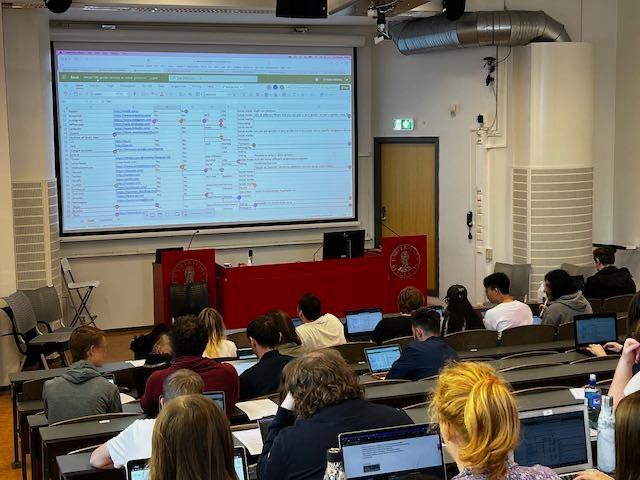

# PlatformGender

This dataset lists 68 online platforms used by BA students in a class at the University of Bergen in August 2022 with information about how gender is handled by the platform. The dataset includes fields indicating whether gender is required at signup, whether gender can be changed after signup, and the country the site is located in or has their main office. Free text comments are included for some sites.

The data was gathered collaboratively by Digital Culture students in [DIKULT106](https://www.uib.no/en/course/DIKULT106) at the University of Bergen in a class session on 30 August 2022. No quality control has been done as it is intended for educational purposes rather than as an authoritative source.

{width="561"}

Scripts in this repository provide simple visualisations of the data, demonstrating issues around data cleaning, classification and interpretation of data.

This is part of a class assignment relating to chapters 4 and 5 of Catherine D'Ignazio and Lauren Klein's book *Data Feminism,* which discuss classification.
